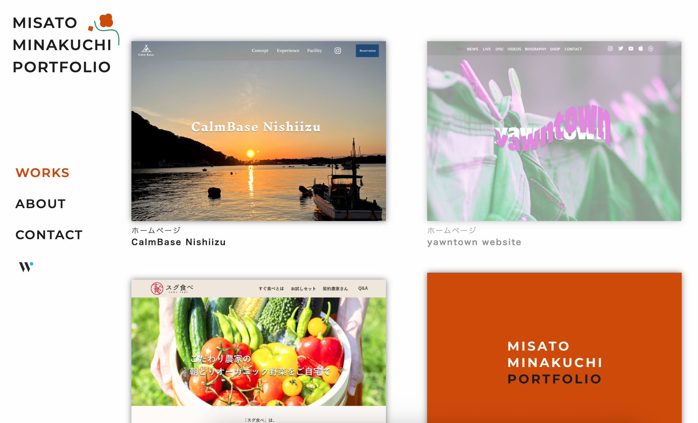
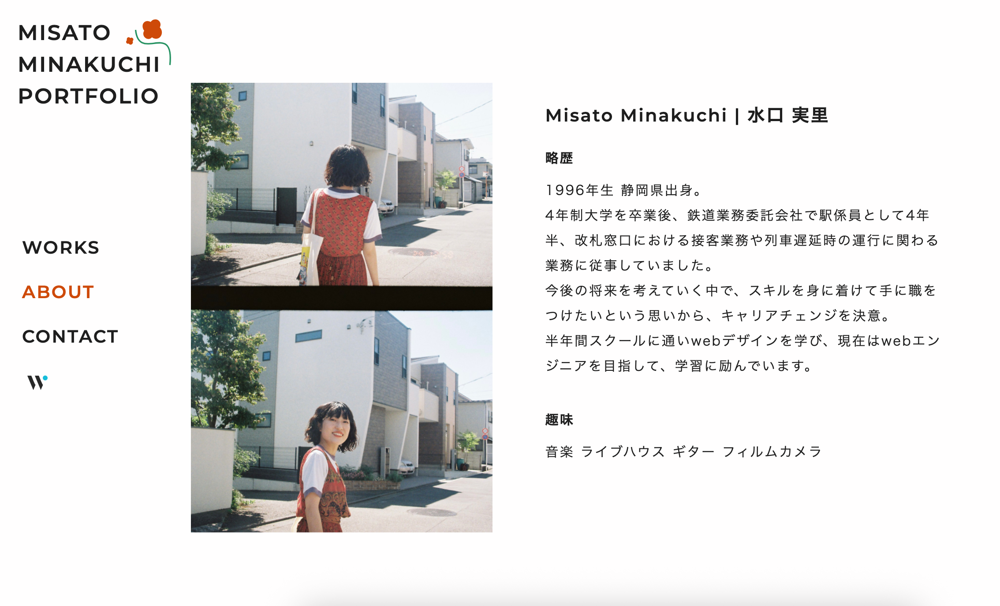

## ポートフォリオサイト（design & frontend)
このリポジトリはデザインやフロントエンドの学習の中で制作したwebサイトをまとめたポートフォリオです。 
UIの再現性や構成意図を意識しており、デザイン寄りの内容になっています。
## 使用スキル・ツール
- Figma / Photoshop / Illustrator：UI設計・ビジュアル制作
- HTML / CSS / JavaScript：静的コーディング
- レスポンシブ対応：モバイル・タブレットへの最適化
- 企画・提案力：構成設計、コンセプト立案(クライアントワーク)
## スクリーンショット
トップページのイメージ： 
 
aboutページのイメージ： 
